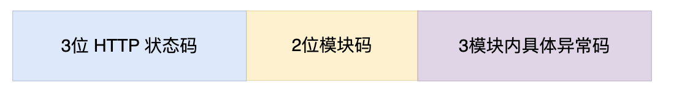

## 背景
接口的正常返回，前端接口需要一个码来标识不同类型的返回，通过识别不同类型的返回来做不同的处理，如接口重定向、异常、参数输入异常等等。异常码需要做一个统一的管理与设计，不然就可能出现异常码混淆，特别是后台调用链路复杂的时候，通过异常码往往非常难以确定发生异常的服务，如果对异常码进行恰当的设计，就可以通过异常码发现异常出错的服务，从而快速的定位问题所在。

## 目标

- 1、异常码、异常类型、异常消息映射关系唯一。
- 2、前端通过异常码，能够快速定位异常问题、异常的子系统。
- 3、同一个系统中异常码值唯一。
- 4、异常类型与HTTP的状态类型相互匹配。

## 设计
异常码使用8位标识，3位http状态码+ 2服务码(或者3位)+3位自定义错误码
- 3位http状态码对应HTTP 状态码，如果有需要，这3位直接设置进HTTP的状态中
- 2位系统码：标识某个系统中的某一个服务，在一个应用中，服务码唯一
- 3位自定义错误码，统一服务或者模块中，同一个http状态的异常情况有多种，这时候使用3位数字标识，能达到错误码唯一对应错误消息的状态。

| HTTP错误状态码(3位)                         | 业务模块(2位)           | 模块之内的异常信息(3位)            |
|---------------------------------------|--------------------|--------------------------|
| 0-599之间的数字，标识http状态码，状态信息和http状态相对应起来 | 0-99 之间的数字，标识错误的模块 | 0-999之间的数字，标识模块之内的具体错误异常 |

## 举例

假设系统有如下模块

| 模块名称 | 模块码 |
|------|-----|
| 用户模块 | 01  |
| 订单模块 | 02  |
| 商品模块 | 03  |

---
列子1:用户模块，用户的头像不存在 分析如下：
- 1、用户头像不存在，HTTP状态码返回 404 
- 2、错误发生在用户模块，用户模块的业务模块编码为 01
- 3、用户头像不存在，模块内自定义一个模块唯一的错误编码，如定义为 101

通过如上分析可得出最终的错误码为 40401101 ( HTTP状态码 + 业务模块 + 模块内自定义错误码 )

---

列子2:订单删除功能还没有实现：
- 1、服务器功能没有实现，HTTP状态码返回 501
- 2、错误发生在订单模块，订单模块的业务模块编码为 02
- 3、删除功能，模块内随便自定义一个模块唯一的错误编码，如定义为 107

通过如上分析可得出最终的错误码为 50102107 ( HTTP状态码 + 业务模块 + 模块内自定义错误码 )

