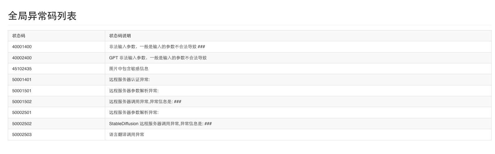
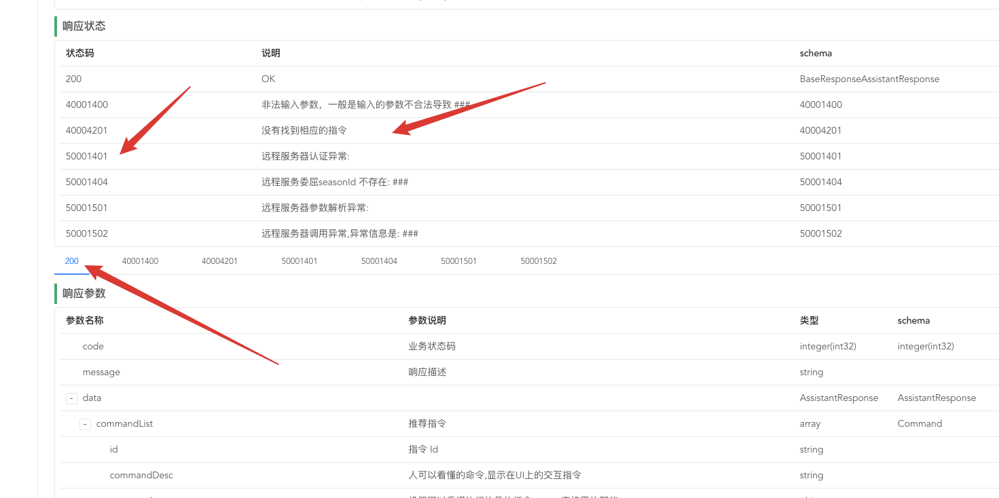

## 背景

Java 结合 openApi 自动生成异常码文档插件，启动的时候自动运行。

```java


import com.opensource.easyddd.infrastructure.exception.base.BaseException;
import com.opensource.easyddd.infrastructure.exception.base._5xx.ExceptionCodeError;
import com.squareup.javapoet.JavaFile;
import com.squareup.javapoet.TypeSpec;

import javax.lang.model.element.Modifier;
import java.io.File;
import java.io.FileFilter;
import java.io.IOException;
import java.net.JarURLConnection;
import java.net.URL;
import java.net.URLDecoder;
import java.util.ArrayList;
import java.util.Enumeration;
import java.util.List;
import java.util.jar.JarEntry;
import java.util.jar.JarFile;

/**
 * 异常信息自动生成
 *
 * @author chenxu
 */
public class ExceptionGenerate {


    public static void main(String[] args) throws IOException {
        createModelBaseException();
    }


    /**
     * 创建各个模块的异常码信息
     * @throws IOException IO 异常
     */
    public static void createModelBaseException() throws IOException {
        Package aPackage = BaseException.class.getPackage();
        String currentPackage = ExceptionGenerate.class.getPackage().getName();
        List<Class<?>> list = getClasses(aPackage.getName());
        ModuleCode[] moduleCodes = ModuleCode.values();
        for (ModuleCode moduleCode : moduleCodes) {
            String name = moduleCode.name();
            String className = convertToCamelCase(moduleCode.name());
            for (Class<?> clazz : list) {
                Class<? extends BaseException> subclass = null;
                try {
                    subclass = clazz.asSubclass(BaseException.class);
                } catch (Exception ignored) {
                }

                if (clazz == ExceptionCodeError.class) {
                    subclass = null;
                }

                if (null != subclass) {
                    String contextName = name.toLowerCase().replace("_", "");

                    generateJavaCode(className + subclass.getSimpleName(), subclass, currentPackage + ".module." + contextName, moduleCode);
                }
            }
        }
    }


    /**
     * 将下划线大写方式命名的字符串转换为驼峰式。如果转换前的下划线大写方式命名的字符串为空，则返回空字符串
     *
     * @param name 转换前的下划线大写方式命名的字符串
     * @return 转换后的驼峰式命名的字符串
     */
    private static String convertToCamelCase(String name) {
        StringBuilder result = new StringBuilder();
        // 快速检查
        if (name == null || name.isEmpty()) {
            // 没必要转换
            return "";
        } else if (!name.contains("_")) {
            // 不含下划线，仅将首字母大写
            String upperCase = name.substring(0, 1).toUpperCase();
            String substring = name.substring(1).toLowerCase();
            return upperCase + substring;
        }
        // 用下划线将原始字符串分割
        String[] camels = name.split("_");
        for (String camel : camels) {
            // 跳过原始字符串中开头、结尾的下换线或双重下划线
            if (camel.isEmpty()) {
                continue;
            }
            // 首字母大写
            result.append(camel.substring(0, 1).toUpperCase());
            result.append(camel.substring(1).toLowerCase());
        }
        return result.toString();
    }


    private static void generateJavaCode(String className,
                                         Class<? extends BaseException> clazz,
                                         String packageName, ModuleCode moduleCode) throws IOException {
        TypeSpec classType = TypeSpec.classBuilder(className)
                .addModifiers(Modifier.PUBLIC, Modifier.ABSTRACT)
                .superclass(clazz)
                .addField(ModuleCode.class, "moduleCode", Modifier.PRIVATE)
                .addMethod(com.squareup.javapoet.MethodSpec.constructorBuilder()
                        .addModifiers(Modifier.PUBLIC)
                        .addParameter(Integer.class, "errorCode")
                        .addException(ExceptionCodeError.class)
                        .addParameter(String.class, "message")
                        .addStatement("super(ModuleCode.$L,errorCode,message);", moduleCode)
                        .build())
                .build();
        JavaFile javaFile = JavaFile.builder(packageName, classType)
                .skipJavaLangImports(false)
                .build();
        File file1 = new File("src/main/java");
        javaFile.writeTo(file1);
    }


    /**
     * 从包package中获取所有的Class
     *
     * @param packageName
     * @return
     */

    private static List<Class<?>> getClasses(String packageName) {
        //第一个class类的集合
        List<Class<?>> classes = new ArrayList<Class<?>>();
        //是否循环迭代
        boolean recursive = true;
        //获取包的名字 并进行替换
        String packageDirName = packageName.replace('.', '/');
        //定义一个枚举的集合 并进行循环来处理这个目录下的things
        Enumeration<URL> dirs;
        try {
            dirs = Thread.currentThread().getContextClassLoader().getResources(packageDirName);
            //循环迭代下去
            while (dirs.hasMoreElements()) {
                //获取下一个元素
                URL url = dirs.nextElement();
                //得到协议的名称
                String protocol = url.getProtocol();
                //如果是以文件的形式保存在服务器上
                if ("file".equals(protocol)) {
                    //获取包的物理路径
                    String filePath = URLDecoder.decode(url.getFile(), "UTF-8");
                    //以文件的方式扫描整个包下的文件 并添加到集合中
                    findAndAddClassesInPackageByFile(packageName, filePath, recursive, classes);
                } else if ("jar".equals(protocol)) {
                    //如果是jar包文件
                    //定义一个JarFile
                    JarFile jar;
                    try {
                        //获取jar
                        jar = ((JarURLConnection) url.openConnection()).getJarFile();
                        //从此jar包 得到一个枚举类
                        Enumeration<JarEntry> entries = jar.entries();
                        //同样的进行循环迭代
                        while (entries.hasMoreElements()) {
                            //获取jar里的一个实体 可以是目录 和一些jar包里的其他文件 如META-INF等文件
                            JarEntry entry = entries.nextElement();
                            String name = entry.getName();
                            //如果是以/开头的
                            if (name.charAt(0) == '/') {
                                //获取后面的字符串
                                name = name.substring(1);
                            }
                            //如果前半部分和定义的包名相同
                            if (name.startsWith(packageDirName)) {
                                int idx = name.lastIndexOf('/');
                                //如果以"/"结尾 是一个包
                                if (idx != -1) {
                                    //获取包名 把"/"替换成"."
                                    packageName = name.substring(0, idx).replace('/', '.');
                                }
                                //如果可以迭代下去 并且是一个包
                                if ((idx != -1) || recursive) {
                                    //如果是一个.class文件 而且不是目录
                                    if (name.endsWith(".class") && !entry.isDirectory()) {
                                        //去掉后面的".class" 获取真正的类名
                                        String className = name.substring(packageName.length() + 1, name.length() - 6);
                                        try {
                                            //添加到classes
                                            classes.add(Class.forName(packageName + '.' + className));
                                        } catch (ClassNotFoundException e) {
                                            e.printStackTrace();
                                        }
                                    }
                                }
                            }
                        }
                    } catch (IOException e) {
                        e.printStackTrace();
                    }
                }
            }
        } catch (IOException e) {
            e.printStackTrace();
        }
        return classes;
    }


    /**
     * 以文件的形式来获取包下的所有Class
     *
     * @param packageName
     * @param packagePath
     * @param recursive
     * @param classes
     */

    private static void findAndAddClassesInPackageByFile(String packageName, String packagePath,
                                                        final boolean recursive, List<Class<?>> classes) {

        //获取此包的目录 建立一个File
        File dir = new File(packagePath);
        //如果不存在或者 也不是目录就直接返回
        if (!dir.exists() || !dir.isDirectory()) {
            return;
        }
        //如果存在 就获取包下的所有文件 包括目录
        File[] dirfiles = dir.listFiles(new FileFilter() {
            //自定义过滤规则 如果可以循环(包含子目录) 或则是以.class结尾的文件(编译好的java类文件)
            public boolean accept(File file) {
                return (recursive && file.isDirectory()) || (file.getName().endsWith(".class"));
            }
        });
        //循环所有文件
        for (File file : dirfiles) {
            //如果是目录 则继续扫描
            if (file.isDirectory()) {
                findAndAddClassesInPackageByFile(packageName + "." + file.getName(),
                        file.getAbsolutePath(),
                        recursive,
                        classes);
            } else {
                //如果是java类文件 去掉后面的.class 只留下类名
                String className = file.getName().substring(0, file.getName().length() - 6);
                try {
                    //添加到集合中去
                    classes.add(Class.forName(packageName + '.' + className));
                } catch (ClassNotFoundException e) {
                    e.printStackTrace();
                }
            }
        }
    }
}


```


最终生成效果如下

全局异常码效果


单个接口异常码效果



